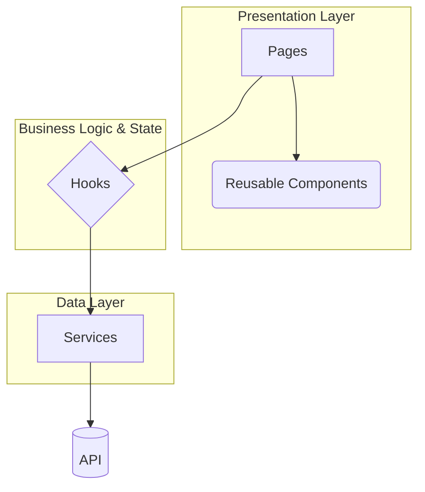
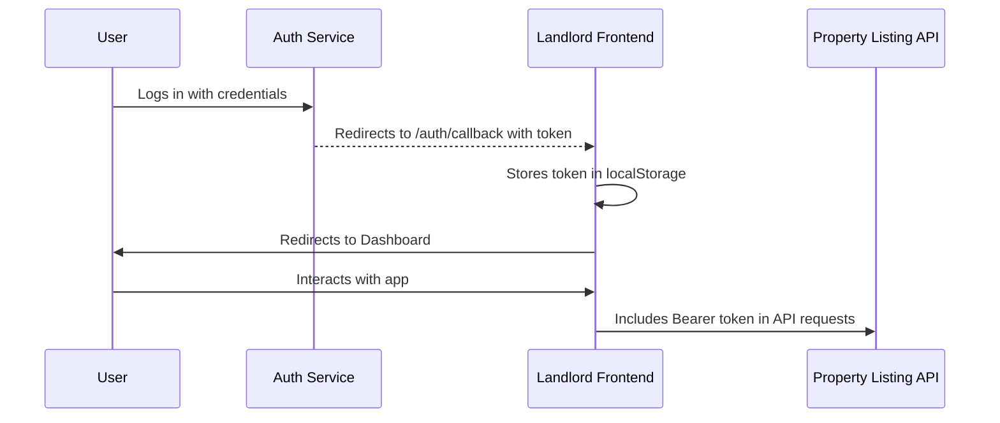

# Rent Management - Landlord Frontend

[](https://reactjs.org/)
[](https://vitejs.dev/)
[](https://ui.shadcn.com/)
[](https://tailwindcss.com/)
[](https://opensource.org/licenses/MIT)

A modern, responsive, and feature-rich frontend application built with React and Vite, designed for landlords. This micro-frontend is a key part of the Rent Management System, providing property owners with a comprehensive dashboard to manage their listings, track performance, and handle payments.

---

## Table of Contents

- [About The Project](#about-the-project)
- [Architectural Design](#architectural-design)
  - [Component-Based Architecture](#component-based-architecture)
  - [Key Directory Structure](#key-directory-structure)
- [Technology Stack](#technology-stack)
- [External Service Integrations](#external-service-integrations)
  - [Property Listing API](#property-listing-api)
  - [Authentication Flow](#authentication-flow)
- [Key Features](#key-features)
- [Getting Started](#getting-started)
  - [Prerequisites](#prerequisites)
  - [Local Installation](#local-installation)
- [Available Scripts](#available-scripts)
- [Contributing](#contributing)
- [License](#license)
- [Contact](#contact)

---

## About The Project

This application serves as the primary interface for landlords within the **Rent Management System**. Its main goal is to offer a seamless and intuitive user experience for managing property portfolios. By using a dedicated micro-frontend, we ensure that the landlord-facing features can be developed, deployed, and scaled independently from other parts of the platform, such as the renter's portal or backend services.

The dashboard provides landlords with at-a-glance metrics, a detailed view of their properties, and the tools needed to edit, approve, and manage the lifecycle of a property listing.

---

## Architectural Design

The application is designed with modern frontend principles to ensure scalability, maintainability, and a clean separation of concerns.

### Component-Based Architecture

The project is built using **React**, following a component-based architecture. This approach promotes reusability and modularity.



-   **Pages (`src/pages`)**: Top-level components that represent distinct views or routes in the application (e.g., `Dashboard`, `PropertyDetails`).
-   **Reusable Components (`src/components`)**: The UI is broken down into smaller, reusable components. This includes both general components (`Header`, `Footer`) and UI primitives from **Shadcn/UI** (`Button`, `Card`, etc.).
-   **Hooks (`src/hooks`)**: Custom React hooks (e.g., `useProperties`) are used to encapsulate and manage complex state, side effects, and data-fetching logic, keeping the page components clean and focused on rendering.
-   **Services (`src/services`)**: All communication with external APIs is centralized in the `propertyService.ts` module. This layer is responsible for making HTTP requests, handling authentication tokens, and normalizing data.

### Key Directory Structure

-   `src/pages`: Each file corresponds to a major route/view.
-   `src/components`: Contains reusable UI components, with `src/components/ui` housing the Shadcn/UI elements.
-   `src/services`: Handles all API communication.
-   `src/hooks`: Custom hooks for managing state and side-effects.
-   `src/lib`: Core utility functions.
-   `public/locales`: Contains JSON files for multi-language support (i18n).

---

## Technology Stack

-   **Core Framework:** [React](https://reactjs.org/) & [Vite](https://vitejs.dev/)
-   **Language:** [TypeScript](https://www.typescriptlang.org/)
-   **UI Component Library:** [Shadcn/UI](https://ui.shadcn.com/)
-   **Styling:** [Tailwind CSS](https://tailwindcss.com/)
-   **Routing:** [React Router](https://reactrouter.com/)
-   **Data Fetching & State:** [TanStack Query (React Query)](https://tanstack.com/query/latest)
-   **Forms:** [React Hook Form](https://react-hook-form.com/) & [Zod](https://zod.dev/) for validation
-   **Internationalization (i18n):** [i18next](https://www.i18next.com/)
-   **Linting:** [ESLint](https://eslint.org/)

---

## External Service Integrations

### Property Listing API

The frontend communicates with a backend microservice responsible for property data. All interactions are handled via a RESTful API.

-   **Service Location**: `src/services/propertyService.ts`
-   **Base URL**: Configured via the `VITE_API_BASE_URL` environment variable.
-   **Key Operations**:
    -   Fetching all properties and properties specific to the logged-in user.
    -   Submitting, updating, and deleting property listings.
    -   Initiating the payment process for property approval.
    -   Marking properties as reserved.

### Authentication Flow

Authentication is handled via JWT (JSON Web Tokens) provided by a central authentication service.



1.  The user authenticates with a separate auth service.
2.  Upon successful login, the user is redirected back to this application at the `/auth/callback` route.
3.  The `AuthCallbackRedirect.tsx` component extracts the `access_token` from the URL hash.
4.  The token is stored in the browser's `localStorage`.
5.  The `propertyService` automatically attaches this token as a `Bearer` token to the `Authorization` header for all subsequent protected API requests.

---

## Key Features

-   **Comprehensive Landlord Dashboard**: At-a-glance view of total listings, approval status, views, and potential revenue.
-   **Full Property CRUD**: Create, Read, Update, and Delete property listings through intuitive forms and dialogs.
-   **Secure Authentication**: Robust JWT-based authentication flow with automatic token handling.
-   **Payment Integration**: Seamlessly redirects landlords to a payment gateway (e.g., Chapa) to pay for listing approvals.
-   **Multi-language Support**: Fully internationalized UI supporting English, Amharic, and Oromo.
-   **Advanced Filtering & Search**: Easily find properties by title, location, status, or reservation status.
-   **Responsive Design**: A mobile-first design that works beautifully on all screen sizes, from desktops to smartphones.
-   **Rich UI Components**: Built with the highly-acclaimed Shadcn/UI and Tailwind CSS for a modern and consistent look and feel.
-   **Real-time Feedback**: Utilizes toasts and notifications to provide instant feedback for user actions.

---

## Getting Started

Follow these instructions to set up and run the project on your local machine.

### Prerequisites

-   Node.js (v18 or higher)
-   A package manager like `npm`, `yarn`, or `bun`.

### Local Installation

1.  **Clone the repository:**
    ```sh
    git clone https://github.com/rent-management-system/rent-management-landlord-frontend.git
    cd rent-management-landlord-frontend
    ```

2.  **Set up the environment file:**
    Create a `.env` file in the root directory by copying the example file.
    ```sh
    cp .env.example .env
    ```
    Open the `.env` file and configure the variables. At a minimum, you'll need to set the backend API URL.
    ```env
    # The base URL for the backend property listing service
    VITE_API_BASE_URL="http://localhost:8000/api/v1/properties"
    ```

3.  **Install dependencies:**
    ```sh
    npm install
    ```

4.  **Run the development server:**
    ```sh
    npm run dev
    ```
    The application will be available at `http://localhost:8080`.

---

## Available Scripts

-   `npm run dev`: Starts the development server with hot-reloading.
-   `npm run build`: Compiles and bundles the application for production.
-   `npm run lint`: Runs the ESLint linter to check for code quality issues.
-   `npm run preview`: Starts a local server to preview the production build.

---

## Contributing

Contributions are what make the open-source community such an amazing place to learn, inspire, and create. Any contributions you make are **greatly appreciated**.

This project is developed and maintained by:
-   [Dagmawi Teferi](https://github.com/dagiteferi)
-   [Abeni](https://github.com/Abeni5)
-   [Nehemya Biruk](https://github.com/Nehmyabiruk)

Please fork the repository and open a pull request with your proposed changes.

1.  Fork the Project
2.  Create your Feature Branch (`git checkout -b feature/AmazingFeature`)
3.  Commit your Changes (`git commit -m 'Add some AmazingFeature'`)
4.  Push to the Branch (`git push origin feature/AmazingFeature`)
5.  Open a Pull Request

---

## License

Distributed under the MIT License. See `LICENSE` for more information.

---

## Contact

**Dagmawi Teferi**

-   **Email:** [dagiteferi2011@gmail.com](mailto:dagiteferi2011@gmail.com)
-   **Project Link:** [https://github.com/rent-management-system/rent-management-landlord-frontend](https://github.com/rent-management-system/rent-management-landlord-frontend)